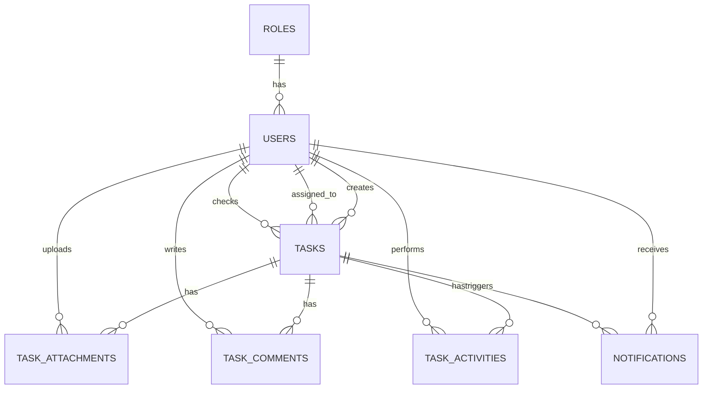

# PRODUCT REQUIREMENTS DOCUMENT (PRD)
# Task Management System — Execution Ready

**Version:** 1.0  
**Date:** 30 September 2026  
**Status:** Ready for Development  
**Target:** Web Application  
**Suggested Stack:** Laravel + MySQL + Blade/Livewire or REST API + SPA (implementation choice)

---

## 1. Product Summary

Task Management System adalah aplikasi internal untuk membuat, memberikan, mengerjakan, memeriksa, dan menyelesaikan pekerjaan dalam satu workflow terstruktur.

Workflow utama:

```text
WAITING → ON PROCESS → ON CHECK → DONE
                         ↓
                    REVISION
                         ↓
                    ON PROCESS
```

Sistem juga menyediakan upload dokumen, komentar, activity log, notification, dashboard monitoring, search/filter, role & permission, dan audit trail.

---

## 2. Goals

1. Memusatkan seluruh task dalam satu sistem.
2. Memastikan setiap task memiliki owner/assignee yang jelas.
3. Menstandarkan workflow pekerjaan.
4. Menyediakan proses review sebelum task dianggap selesai.
5. Menyimpan dokumen pendukung di task.
6. Menyediakan histori perubahan yang dapat ditelusuri.
7. Memberikan dashboard monitoring untuk Admin/Manager.
8. Mengurangi pekerjaan manual melalui notifikasi dan status tracking.

## 3. Non-Goals / Out of Scope MVP

- Real-time collaborative editing dokumen.
- AI untuk membuat atau memeriksa pekerjaan.
- Integrasi ERP/CRM.
- Payroll.
- Project budgeting.
- Advanced resource planning.
- WhatsApp/Telegram integration.
- Multi-level approval kompleks.

---

# 4. Users & Roles

## 4.1 Roles

| Role | Fungsi |
|---|---|
| ADMIN | Mengelola seluruh sistem, user, role, dan task |
| MANAGER | Membuat, assign, memonitor, dan melakukan checking |
| STAFF | Mengerjakan task yang diberikan |
| CHECKER | Memeriksa hasil dan approve/request revision |

## 4.2 Permission Matrix

| Action | Admin | Manager | Staff | Checker |
|---|---:|---:|---:|---:|
| Login | ✓ | ✓ | ✓ | ✓ |
| View dashboard | ✓ | ✓ | ✓ | ✓ |
| Create task | ✓ | ✓ | Optional | Optional |
| View all tasks | ✓ | ✓ | - | Optional |
| View assigned task | ✓ | ✓ | ✓ | ✓ |
| Edit task | ✓ | ✓ | Own/assigned | - |
| Delete task | ✓ | ✓ | - | - |
| Assign task | ✓ | ✓ | - | - |
| Start task | ✓ | ✓ | ✓ | ✓ |
| Upload document | ✓ | ✓ | ✓ | ✓ |
| Submit for check | ✓ | ✓ | ✓ | - |
| Request revision | ✓ | ✓ | - | ✓ |
| Approve task | ✓ | ✓ | - | ✓ |
| Comment | ✓ | ✓ | ✓ | ✓ |
| View activity | ✓ | ✓ | ✓ assigned | ✓ relevant |
| Manage users | ✓ | - | - | - |
| Manage roles | ✓ | - | - | - |

> Permission harus disimpan dan dicek di backend. UI hiding saja tidak cukup.

---

# 5. Core Workflow

## 5.1 Status Definition

| Status | Meaning |
|---|---|
| WAITING | Task dibuat tetapi belum mulai dikerjakan |
| ON_PROCESS | Task sedang dikerjakan |
| ON_CHECK | Hasil pekerjaan sudah dikirim untuk diperiksa |
| DONE | Hasil telah disetujui |

## 5.2 Valid Transitions

| Current | Action | Next | Actor |
|---|---|---|---|
| WAITING | Start Task | ON_PROCESS | Assignee/authorized |
| ON_PROCESS | Submit for Check | ON_CHECK | Assignee/authorized |
| ON_CHECK | Approve | DONE | Checker/Manager/Admin |
| ON_CHECK | Request Revision | ON_PROCESS | Checker/Manager/Admin |
| DONE | Reopen | ON_PROCESS | Manager/Admin |

## 5.3 Rules

1. Task baru selalu `WAITING`.
2. Task tidak dapat dimulai tanpa assignee.
3. Assignee dapat memindahkan task ke `ON_PROCESS`.
4. Hanya task `ON_PROCESS` yang dapat dikirim ke `ON_CHECK`.
5. `ON_CHECK` membutuhkan checker/role yang berwenang.
6. Checker wajib memberikan alasan ketika meminta revisi.
7. Hanya checker/Manager/Admin yang dapat mengubah `ON_CHECK` menjadi `DONE`.
8. Setiap perubahan status wajib dicatat di activity log.
9. Saat menjadi `DONE`, `completed_at` diisi.
10. Saat direvisi, `completed_at` dikosongkan jika sebelumnya terisi.

---

# 6. Information Architecture

```text
Task Management
│
├── Dashboard
│
├── Tasks
│   ├── All Tasks
│   ├── My Tasks
│   ├── Waiting
│   ├── On Process
│   ├── On Check
│   └── Done
│
├── Create Task
│
├── Notifications
│
└── Settings
    ├── Profile
    ├── Users              [Admin]
    └── Roles & Permissions [Admin]
```

### MVP Navigation Recommendation

Status tidak wajib menjadi menu terpisah. Pada UI, gunakan tab/filter:

```text
All | Waiting | On Process | On Check | Done
```

Ini mengurangi kompleksitas navigasi.

---

# 7. Dashboard

## 7.1 Dashboard Cards

```text
+-------------+ +-------------+ +-------------+ +-------------+
| WAITING     | | ON PROCESS  | | ON CHECK    | | DONE        |
|     12      | |      8      | |      5      | |     34      |
+-------------+ +-------------+ +-------------+ +-------------+

+-------------+ +-------------+
| OVERDUE     | | DUE SOON    |
|      3      | |      7      |
+-------------+ +-------------+
```

## 7.2 Dashboard Content

### Admin/Manager
- Total Waiting
- Total On Process
- Total On Check
- Total Done
- Overdue
- Due Soon
- Recent Tasks
- Tasks by assignee
- Recent activities

### Staff
- My Waiting
- My On Process
- My On Check
- My Done
- My Overdue
- My Due Soon
- Recent assigned tasks

### Checker
- Tasks waiting for review
- Tasks returned for revision
- Recently approved tasks

---

# 8. Task List

## Filters

- Search title / Task ID
- Status
- Priority
- Assignee
- Checker
- Due date
- Created date

## Table

| Column | Required |
|---|---|
| Task ID | Yes |
| Title | Yes |
| Assignee | Yes |
| Checker | Yes |
| Priority | Yes |
| Status | Yes |
| Due Date | Yes |
| Updated At | Yes |
| Action | Yes |

Actions:

```text
View | Edit | Delete
```

Delete hanya untuk role yang berwenang.

---

# 9. Create Task

## Required Fields

| Field | Required |
|---|---|
| Title | Yes |
| Description | Yes |
| Assignee | Yes |
| Checker | Recommended |
| Priority | Yes |
| Due Date | Optional |
| Attachment | Optional |

Default:

```text
status = WAITING
```

## Validation

- Title: 3–255 characters.
- Description: optional/required according to implementation policy; MVP recommended required.
- Assignee must be active.
- Checker must be active if checking is enabled.
- Due date cannot be earlier than current time for new task.
- Attachment must pass allowed MIME/extension and size validation.

---

# 10. Task Detail

Recommended layout:

```text
--------------------------------------------------------------
TASK #0001
Create Monthly Financial Report
--------------------------------------------------------------

Status:
[ WAITING ] → [ ON PROCESS ] → [ ON CHECK ] → [ DONE ]

Description
--------------------------------------------------------------
...

Task Information
Creator     : Admin
Assignee    : Andi
Checker     : Budi
Priority    : HIGH
Due Date    : 02 Oct 2026
Created     : 30 Sep 2026
--------------------------------------------------------------

Actions
[ Start Task ] [ Upload ] [ Submit for Check ]

--------------------------------------------------------------
Attachments
📄 report.pdf       2.4 MB     [Download]
📊 data.xlsx        1.2 MB     [Download]

--------------------------------------------------------------
Comments
...

--------------------------------------------------------------
Activity
...
```

Action button berubah berdasarkan status.

---

# 11. Document Management

## Upload

User dapat:
- Upload saat create task.
- Upload dari task detail.
- Upload multiple files.
- Download file sesuai permission.
- Delete file sesuai permission.

## Metadata

```text
id
task_id
uploaded_by
file_name
file_path
mime_type
file_size
created_at
updated_at
```

## Recommended Allowed Files

```text
PDF
DOC
DOCX
XLS
XLSX
PPT
PPTX
JPG
JPEG
PNG
ZIP
```

Recommended default maximum size: **10 MB/file**. Nilai final dapat diubah melalui configuration.

## Security

- Validasi MIME type dan extension.
- Jangan menyimpan file sensitif di public directory tanpa authorization.
- Gunakan generated storage filename/key.
- Download melalui endpoint yang mengecek permission.
- Reject executable files (`.php`, `.exe`, `.js`, dll.).

---

# 12. Comments

Comments digunakan untuk:
- Instruksi.
- Diskusi.
- Feedback.
- Alasan revisi.

Fields:

```text
id
task_id
user_id
comment
created_at
updated_at
```

Request Revision wajib memiliki comment/alasan.

---

# 13. Activity Log

Activity wajib mencatat:

- Task created
- Task updated
- Assignee changed
- Checker changed
- Priority changed
- Due date changed
- Attachment uploaded
- Attachment deleted
- Status changed
- Comment added
- Task approved
- Revision requested
- Task reopened
- Task deleted

Contoh:

```text
30 Sep 2026 18:30
Andi changed status:
WAITING → ON_PROCESS

30 Sep 2026 18:45
Andi uploaded:
Monthly_Report.pdf

30 Sep 2026 19:00
Andi submitted task for checking

30 Sep 2026 19:10
Budi requested revision:
"Please revise page 3."
```

---

# 14. Notifications

Notification types:

| Type | Recipient |
|---|---|
| TASK_ASSIGNED | Assignee |
| TASK_SUBMITTED | Checker |
| TASK_REVISION | Assignee |
| TASK_APPROVED | Assignee |
| TASK_DUE_SOON | Assignee |
| TASK_OVERDUE | Assignee/Manager |

Fields:

```text
id
user_id
task_id
type
title
message
is_read
read_at
created_at
updated_at
```

MVP dapat menggunakan in-app notification terlebih dahulu.

---

# 15. User Management

Admin dapat:

- Create user
- Edit user
- Activate/deactivate user
- Reset password
- Assign role
- Search/filter user

User fields:

```text
id
role_id
name
email
password
is_active
created_at
updated_at
```

Email harus unique.

---

# 16. Database Schema

## Tables

```text
roles
users
tasks
task_attachments
task_comments
task_activities
notifications
```

## ERD



## Tasks Table

```text
tasks
- id PK
- title
- description
- created_by FK users.id
- assignee_id FK users.id
- checker_id FK users.id nullable
- status ENUM
- priority ENUM
- due_date nullable
- completed_at nullable
- created_at
- updated_at
```

## Recommended Indexes

```text
tasks(status)
tasks(assignee_id)
tasks(checker_id)
tasks(created_by)
tasks(priority)
tasks(due_date)
tasks(status, due_date)
task_attachments(task_id)
task_comments(task_id)
task_activities(task_id)
notifications(user_id, is_read)
```

---

# 17. API Specification

## Authentication

```http
POST /api/auth/login
POST /api/auth/logout
GET  /api/auth/me
```

## Tasks

```http
GET    /api/tasks
POST   /api/tasks
GET    /api/tasks/{id}
PUT    /api/tasks/{id}
DELETE /api/tasks/{id}
```

## Status

```http
PATCH /api/tasks/{id}/status
```

Request:

```json
{
  "status": "ON_CHECK",
  "comment": "Task is ready for review."
}
```

## Attachments

```http
GET    /api/tasks/{id}/attachments
POST   /api/tasks/{id}/attachments
DELETE /api/attachments/{id}
GET    /api/attachments/{id}/download
```

## Comments

```http
GET  /api/tasks/{id}/comments
POST /api/tasks/{id}/comments
```

## Activities

```http
GET /api/tasks/{id}/activities
```

## Notifications

```http
GET   /api/notifications
PATCH /api/notifications/{id}/read
PATCH /api/notifications/read-all
```

## Users

```http
GET    /api/users
POST   /api/users
GET    /api/users/{id}
PUT    /api/users/{id}
PATCH  /api/users/{id}/status
DELETE /api/users/{id}
```

---

# 18. API Business Validation

Backend harus menolak invalid transition.

Example:

```text
WAITING → DONE
```

Result:

```http
422 Unprocessable Entity
```

Response:

```json
{
  "message": "Invalid status transition.",
  "current_status": "WAITING",
  "requested_status": "DONE"
}
```

Authorization failure:

```http
403 Forbidden
```

Validation failure:

```http
422 Unprocessable Entity
```

Not found:

```http
404 Not Found
```

---

# 19. Laravel Structure Recommendation

```text
app/
├── Models/
│   ├── User.php
│   ├── Role.php
│   ├── Task.php
│   ├── TaskAttachment.php
│   ├── TaskComment.php
│   ├── TaskActivity.php
│   └── Notification.php
│
├── Http/
│   ├── Controllers/
│   │   ├── AuthController.php
│   │   ├── DashboardController.php
│   │   ├── TaskController.php
│   │   ├── TaskAttachmentController.php
│   │   ├── TaskCommentController.php
│   │   ├── NotificationController.php
│   │   └── UserController.php
│   │
│   └── Requests/
│       ├── StoreTaskRequest.php
│       ├── UpdateTaskRequest.php
│       ├── ChangeTaskStatusRequest.php
│       └── UploadAttachmentRequest.php
│
├── Services/
│   ├── TaskService.php
│   ├── TaskStatusService.php
│   └── NotificationService.php
│
└── Policies/
    ├── TaskPolicy.php
    └── UserPolicy.php
```

## Why use TaskStatusService?

Status transition rules should not be scattered across controllers.

Example:

```text
TaskController
      ↓
TaskStatusService
      ↓
validate transition
      ↓
update task
      ↓
write activity
      ↓
create notification
```

---

# 20. UI Routes

Recommended web routes:

```text
/login
/dashboard

/tasks
/tasks/create
/tasks/{id}
/tasks/{id}/edit

/notifications

/profile

/admin/users
/admin/users/create
/admin/users/{id}/edit

/admin/roles
```

---

# 21. Frontend Components

Reusable components:

```text
StatusBadge
PriorityBadge
TaskCard
TaskTable
TaskFilter
TaskForm
TaskTimeline
AttachmentList
CommentList
CommentForm
NotificationDropdown
DashboardCard
Pagination
ConfirmDialog
FileUploader
```

---

# 22. UX Rules

1. Status harus selalu terlihat pada task.
2. Action button harus mengikuti status.
3. Tombol destructive seperti Delete menggunakan confirmation.
4. Upload menampilkan progress/error.
5. Empty state harus jelas.
6. Loading state harus tersedia.
7. Error harus menjelaskan tindakan yang perlu dilakukan user.
8. Responsive untuk desktop dan mobile.
9. Form mempertahankan input jika validation gagal.
10. Jangan hanya mengandalkan warna untuk membedakan status; gunakan text label.

---

# 23. Dashboard Queries

Minimum query:

```sql
SELECT status, COUNT(*)
FROM tasks
GROUP BY status;
```

Overdue:

```sql
SELECT COUNT(*)
FROM tasks
WHERE due_date < NOW()
AND status != 'DONE';
```

My Tasks:

```sql
SELECT *
FROM tasks
WHERE assignee_id = :user_id
ORDER BY due_date ASC;
```

Tasks waiting for checker:

```sql
SELECT *
FROM tasks
WHERE checker_id = :user_id
AND status = 'ON_CHECK'
ORDER BY updated_at ASC;
```

---

# 24. Acceptance Criteria

## Authentication

- User dengan credential valid dapat login.
- User inactive tidak dapat login.
- User dapat logout.

## Task

- User berpermission dapat membuat task.
- Task baru berstatus WAITING.
- Task memiliki ID.
- Assignee tersimpan.
- Checker dapat disimpan.

## Workflow

- WAITING dapat menjadi ON_PROCESS.
- ON_PROCESS dapat menjadi ON_CHECK.
- ON_CHECK dapat menjadi DONE.
- ON_CHECK dapat kembali ON_PROCESS.
- Invalid transition ditolak.
- Setiap transition membuat activity log.

## Document

- File valid dapat diupload.
- File invalid ditolak.
- File dapat didownload sesuai permission.
- File dapat dihapus sesuai permission.
- Metadata file tersimpan.

## Review

- Assignee dapat Submit for Check.
- Checker dapat Approve.
- Checker dapat Request Revision.
- Request Revision membutuhkan alasan.

## Dashboard

- Counter status akurat.
- Overdue akurat.
- User melihat data sesuai role.

## Security

- User tidak dapat mengakses task tanpa permission.
- File tidak dapat didownload tanpa authorization.
- Password disimpan menggunakan hashing.
- Input divalidasi server-side.

---

# 25. Non-Functional Requirements

## Security

- Password hashing.
- CSRF protection untuk web forms.
- Authorization via Policy/Gate.
- Server-side validation.
- Secure file storage.
- Audit log.
- Rate limiting untuk authentication endpoint.

## Performance

Target MVP:

- Normal page/API response ≤ 2 detik pada workload normal.
- Pagination wajib untuk task list.
- Hindari N+1 query menggunakan eager loading.
- Index digunakan pada kolom filter/sort utama.

## Reliability

- Database backup berkala.
- File storage backup.
- Transaction digunakan untuk perubahan status + activity log.
- Error logging aktif.

## Scalability

- Attachment storage dipisahkan dari database.
- Gunakan pagination.
- Gunakan queue jika notification/email berkembang.

---

# 26. Important Transaction Rule

Perubahan status harus atomic.

Contoh:

```text
BEGIN TRANSACTION

1. Validate permission
2. Validate current status
3. Update tasks.status
4. Update completed_at if needed
5. Insert task_activities
6. Insert notification

COMMIT
```

Jika salah satu proses gagal:

```text
ROLLBACK
```

Tujuannya agar status task tidak berubah tetapi activity/notification gagal tersimpan.

---

# 27. MVP Development Phases

## Phase 1 — Foundation

- Laravel project
- Database
- Authentication
- User
- Role
- Permission

## Phase 2 — Task Core

- Create task
- Edit task
- Delete task
- Task list
- Task detail
- Assignment
- Priority
- Due date

## Phase 3 — Workflow

- Waiting
- On Process
- On Check
- Done
- Revision
- Status validation
- Activity log

## Phase 4 — Documents

- Upload
- Download
- Delete
- File validation
- Secure storage

## Phase 5 — Collaboration

- Comments
- Notifications

## Phase 6 — Dashboard

- Status cards
- Overdue
- Due soon
- Recent tasks
- Role-specific dashboard

## Phase 7 — QA/UAT

- Functional testing
- Permission testing
- Workflow testing
- File security testing
- Performance testing
- User acceptance testing

---

# 28. Development Checklist

## Backend

- [ ] Authentication
- [ ] Roles
- [ ] Permissions
- [ ] User CRUD
- [ ] Task CRUD
- [ ] Task assignment
- [ ] Status service
- [ ] Status transition validation
- [ ] Attachment service
- [ ] Comments
- [ ] Activity log
- [ ] Notifications
- [ ] Policies
- [ ] API validation
- [ ] Error handling
- [ ] Logging

## Frontend

- [ ] Login
- [ ] Dashboard
- [ ] Task list
- [ ] Task filter
- [ ] Create task
- [ ] Edit task
- [ ] Task detail
- [ ] Status action
- [ ] File uploader
- [ ] Attachment list
- [ ] Comments
- [ ] Activity timeline
- [ ] Notifications
- [ ] User management
- [ ] Responsive layout
- [ ] Empty/loading/error states

## Database

- [ ] migrations
- [ ] foreign keys
- [ ] indexes
- [ ] seeders
- [ ] role seed
- [ ] test data
- [ ] backup strategy

---

# 29. UAT Test Scenarios

| ID | Scenario | Expected |
|---|---|---|
| UAT-01 | Login valid | Dashboard displayed |
| UAT-02 | Login invalid | Error displayed |
| UAT-03 | Create task | Task = WAITING |
| UAT-04 | Start task | WAITING → ON_PROCESS |
| UAT-05 | Submit check | ON_PROCESS → ON_CHECK |
| UAT-06 | Approve | ON_CHECK → DONE |
| UAT-07 | Revision | ON_CHECK → ON_PROCESS |
| UAT-08 | Invalid transition | Request rejected |
| UAT-09 | Upload valid PDF | Upload successful |
| UAT-10 | Upload invalid file | Upload rejected |
| UAT-11 | Download unauthorized file | 403 |
| UAT-12 | Add comment | Comment displayed |
| UAT-13 | Status changed | Activity recorded |
| UAT-14 | Assignment | Assignee receives notification |
| UAT-15 | Overdue task | Appears in overdue |
| UAT-16 | Role restriction | Unauthorized action rejected |

---

# 30. Definition of Done

MVP dianggap selesai apabila:

1. Authentication berjalan.
2. Role & permission berjalan.
3. Task CRUD berjalan.
4. Assignment berjalan.
5. Workflow berjalan:
   `WAITING → ON_PROCESS → ON_CHECK → DONE`.
6. Revision berjalan:
   `ON_CHECK → ON_PROCESS`.
7. Upload/download dokumen berjalan aman.
8. Comments berjalan.
9. Activity log berjalan.
10. Notification dasar berjalan.
11. Dashboard menampilkan data sesuai role.
12. Search/filter berjalan.
13. UAT utama lulus.
14. Tidak ada critical/blocker bug.
15. Database migration dan seeder tersedia.
16. Deployment configuration terdokumentasi.

---

# 31. Recommended First Release

Fokus release pertama:

```text
LOGIN
  ↓
DASHBOARD
  ↓
TASK LIST
  ↓
CREATE TASK
  ↓
WAITING
  ↓
ON PROCESS
  ↓
UPLOAD DOCUMENT
  ↓
ON CHECK
  ↓
APPROVE / REVISION
  ↓
DONE
```

Fitur yang dapat ditunda:

```text
Advanced reports
External integrations
AI
Recurring tasks
Subtasks
Document versioning
WhatsApp notification
Advanced analytics
```

---

# 32. Final Product Flow

```text
                    ┌──────────────┐
                    │    CREATE    │
                    │     TASK     │
                    └──────┬───────┘
                           ↓
                    ┌──────────────┐
                    │   WAITING    │
                    └──────┬───────┘
                           │ Start
                           ↓
                    ┌──────────────┐
                    │ ON PROCESS   │
                    └──────┬───────┘
                           │ Submit
                           ↓
                    ┌──────────────┐
                    │   ON CHECK   │
                    └───┬──────┬───┘
                        │      │
                  Approve      │ Revision
                        │      │
                        ↓      ↓
                  ┌───────┐  ┌────────────┐
                  │ DONE  │  │ ON PROCESS │
                  └───────┘  └────────────┘
```

---

# 33. Implementation Decision Summary

| Area | Decision |
|---|---|
| Database | MySQL |
| Backend | Laravel |
| Authentication | Laravel authentication |
| Authorization | Policy/Gate + role permission |
| Task status | ENUM / controlled state machine |
| File storage | Private storage |
| Activity | Dedicated `task_activities` table |
| Comments | Dedicated `task_comments` table |
| Notification | In-app MVP |
| Dashboard | Role-based |
| Task list | Table + filter |
| Task detail | Timeline + attachment + comment |
| Status transition | Centralized service |
| API | RESTful |
| Pagination | Required |
| Audit trail | Required |

---

# 34. Next Implementation Order

Developer dapat mengeksekusi dengan urutan:

```text
1. Create Laravel project
2. Configure MySQL
3. Create migrations
4. Create models + relationships
5. Create role/user seeders
6. Implement authentication
7. Implement authorization
8. Implement Task CRUD
9. Implement TaskStatusService
10. Implement activity log
11. Implement attachment
12. Implement comments
13. Implement notifications
14. Implement dashboard
15. Implement filters/search
16. Write feature tests
17. Run UAT
18. Security review
19. Deployment
```

**End of PRD**
